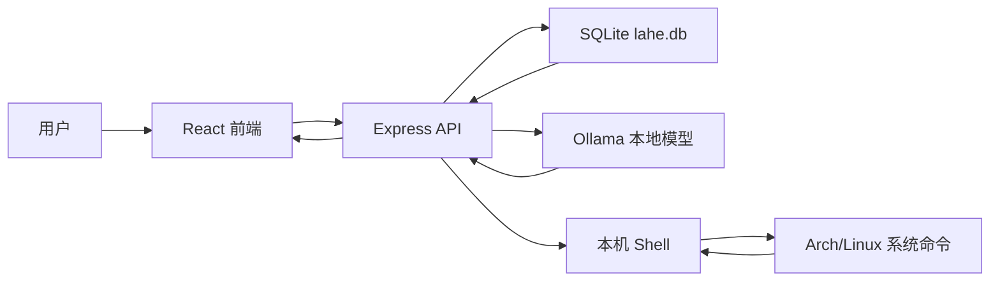
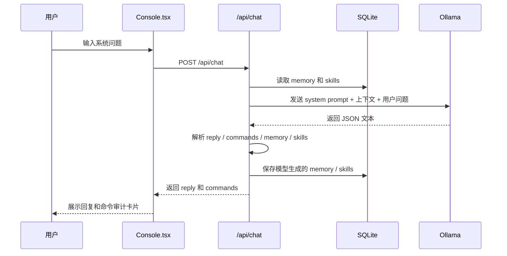
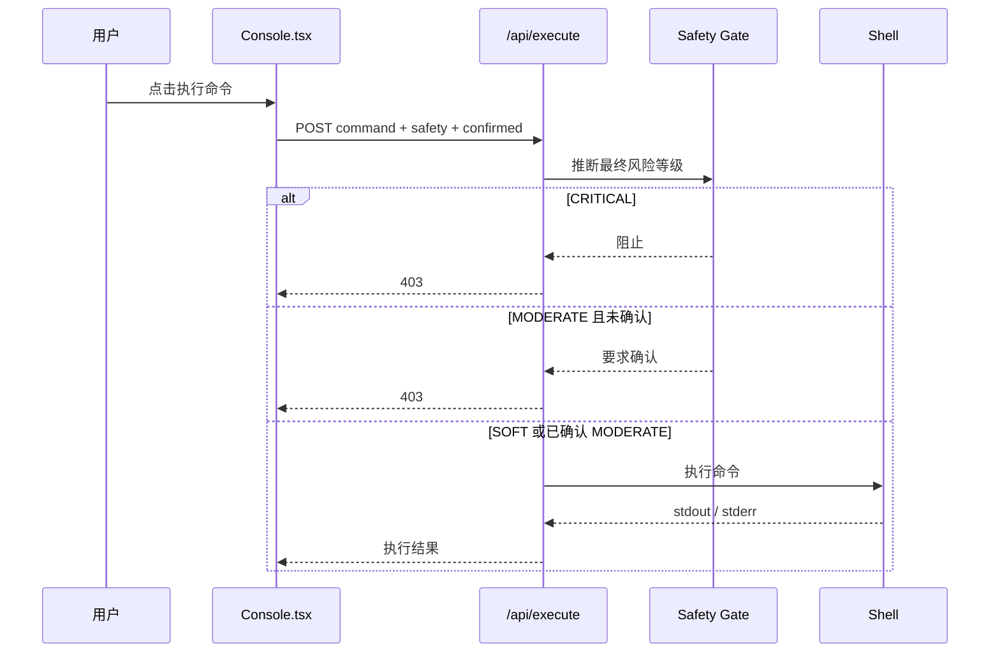
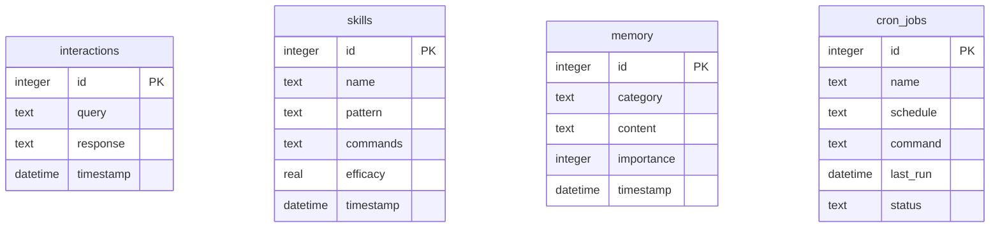

# LAhe 架构文档

## 1. 架构目标

LAhe 采用本地优先架构。系统默认在用户自己的机器上运行，AI 推理通过本机 Ollama 完成，系统状态、日志和命令执行也只访问本机环境。

架构目标：

- 保护用户系统信息和诊断内容，默认不依赖云端 AI。
- 让 AI 建议、命令审计、用户确认、命令执行形成闭环。
- 在 Windows 上支持日常开发，在 Arch/Linux 上验证完整系统能力。
- 保持单机部署简单，MVP 阶段避免引入复杂服务编排。
- 后端必须是安全边界，前端不能绕过后端直接执行系统命令。

## 2. 总体架构



MVP 使用一个 Node.js 进程启动 `server.ts`：

- 开发模式：Express API + Vite middleware。
- 生产模式：Express API + `dist` 静态文件。
- 本地数据库：项目根目录 `lahe.db`。
- 本地模型：默认 `http://localhost:11434` 的 Ollama API。

## 3. 前端架构

前端位于 `src/`，使用 React + TypeScript + Tailwind CSS。

主要模块：

- `src/App.tsx`：应用壳、侧边栏导航、视图切换。
- `src/components/Console.tsx`：AI 控制台、命令审计卡片、命令执行入口。
- `src/components/HistoryView.tsx`：交互历史。
- `src/components/LogViewer.tsx`：系统日志查看。
- `src/components/SystemStats.tsx`：系统状态面板。
- `src/components/NeuralMap.tsx`：记忆与技能展示。
- `src/components/Scheduler.tsx`：计划任务展示。
- `src/lib/i18n.tsx`：中英文文案。
- `src/types.ts`：前端共享类型。

前端职责：

- 渲染本地系统助手界面。
- 收集用户输入并调用后端 API。
- 展示 AI 回复和命令审计结果。
- 对 `MODERATE` 和 `CRITICAL` 命令提供不同交互状态。
- 展示历史、日志、系统状态、记忆、技能和计划任务。

前端不负责：

- 不直接调用 Ollama。
- 不直接执行系统命令。
- 不保存安全策略最终判断。
- 不持有任何云端模型 API Key。

## 4. 后端架构

后端入口是 `server.ts`，基于 Express。

后端职责：

- 提供统一 API。
- 调用 Ollama 本地模型。
- 组装系统提示词、记忆和技能上下文。
- 解析本地模型返回的结构化 JSON。
- 对命令进行后端安全推断。
- 执行允许范围内的本机 shell 命令。
- 初始化和访问 SQLite 数据库。
- 在开发模式下挂载 Vite middleware。

核心 API：

| 方法 | 路径 | 说明 |
| --- | --- | --- |
| `POST` | `/api/chat` | 调用本地模型，返回回复和命令审计 |
| `POST` | `/api/execute` | 执行通过安全校验的命令 |
| `GET` | `/api/stats` | 获取系统状态 |
| `GET` | `/api/logs` | 获取最近 journal 日志 |
| `GET` | `/api/history` | 获取交互历史 |
| `POST` | `/api/history` | 保存交互历史 |
| `GET` | `/api/memory` | 获取持久记忆 |
| `POST` | `/api/memory` | 保存持久记忆 |
| `GET` | `/api/skills` | 获取技能流程 |
| `POST` | `/api/skills` | 保存技能流程 |
| `GET` | `/api/cron` | 获取计划任务 |
| `POST` | `/api/cron` | 新增计划任务 |

## 5. AI 调用架构

LAhe MVP 默认使用 Ollama。

配置项：

```env
OLLAMA_BASE_URL="http://localhost:11434"
OLLAMA_MODEL="qwen3.5:0.8b"
```

调用流程：



模型期望返回结构：

```json
{
  "reply": "自然语言回复",
  "commands": [
    {
      "command": "journalctl -p err -b",
      "safety": "SOFT",
      "explanation": "查看本次启动中的错误日志",
      "risks": []
    }
  ],
  "memory": [],
  "skills": []
}
```

后端必须容错：

- 模型返回纯 JSON 时直接解析。
- 模型返回夹杂文本时尝试提取 JSON 对象。
- JSON 解析失败时把原文作为普通回复返回。
- 命令安全等级以后端推断为准，模型等级只能作为参考。

## 6. 命令执行架构

命令执行是高风险能力，安全边界必须在后端。

执行流程：



风险等级：

- `SOFT`：只读查询，允许执行。
- `MODERATE`：会修改系统状态，需要前端明确确认。
- `CRITICAL`：高危命令，默认阻止。

当前安全策略仍是 MVP 级别，后续应升级为更严格的策略引擎。

## 7. 数据架构

MVP 使用 SQLite，数据库文件为 `lahe.db`。

当前表：

| 表 | 说明 |
| --- | --- |
| `interactions` | 用户问题和 AI 回复 |
| `skills` | 模型沉淀的技能流程 |
| `memory` | 持久记忆节点 |
| `cron_jobs` | 计划任务定义 |

当前数据关系：



后续建议新增：

- `command_executions`：记录命令、风险等级、确认状态、结果、退出码。
- `audit_events`：记录安全拦截、危险命令、模型异常输出。
- `settings`：记录本地配置和 UI 偏好。

## 8. 环境架构

Windows 开发：

- 编写和调试 React / TypeScript / Express。
- 可运行 `npm run lint`、`npm run build`、`npm run dev`。
- 系统状态和日志接口降级。
- 可连接 Windows 上的 Ollama 做 AI 控制台测试。

Arch/Linux 测试：

- 验证 `journalctl`。
- 验证 `uptime`、`free`、`df`、`top`。
- 验证 `systemctl`、`pacman` 等 Arch 命令建议。
- 验证命令执行安全策略。

## 9. 安全边界

必须遵守：

- 前端永远不能直接执行命令。
- `/api/execute` 必须独立判断命令风险。
- `CRITICAL` 命令默认阻止。
- 不建议以 root 身份运行服务。
- 不建议将服务暴露到公网。
- `.env.local`、`lahe.db` 不提交到 Git。
- 本地模型返回的命令不能被直接信任。

## 10. 已知架构债务

- `server.ts` 当前承担过多职责，后续应拆分为 routes、services、db、safety 等模块。
- 命令安全推断仍是正则规则，后续应引入白名单、命令解析和更细粒度策略。
- AI JSON schema 目前靠 prompt 约束，后续应增加运行时校验。
- 命令执行未记录到数据库。
- 计划任务尚未真正调度。
- 系统状态仍有部分展示数据是静态内容。
- 前端命令执行按钮对 `MODERATE` 的确认交互还可以更明确。

## 11. 推荐演进方向

短期：

- 拆分后端模块。
- 增加 command execution 表。
- 强化 `/api/chat` 响应校验。
- 完善命令确认 UI。

中期：

- 增加日志 AI 分析。
- 完成历史详情和命令执行记录。
- 技能流程可手动触发。
- 计划任务支持启停和执行日志。

长期：

- 引入更严格的本地策略引擎。
- 支持多模型配置。
- 支持远程 Arch 主机代理，但默认保持本地优先。

