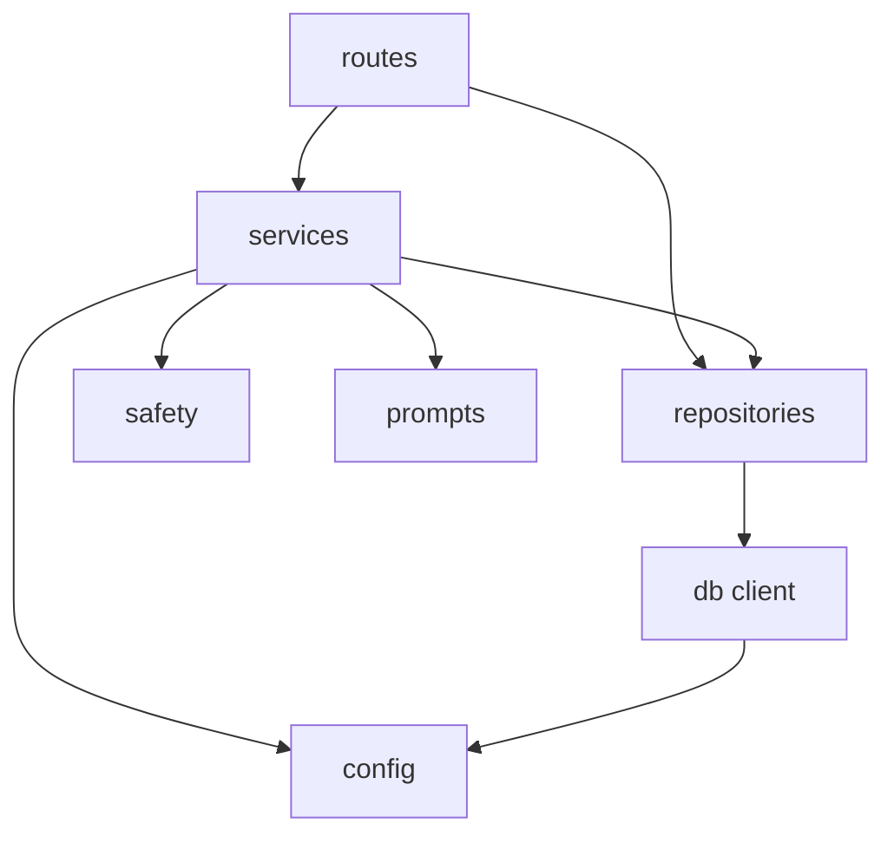

# LAhe 后端模块拆分设计

## 1. 设计目标

当前 `server.ts` 同时承担了服务启动、数据库初始化、AI 调用、命令安全判断、命令执行、系统状态读取和所有 API 路由。MVP 可以运行，但继续扩展时会变得难以维护。

后端拆分目标：

- 让 `server.ts` 只负责启动应用。
- 让每类 API 路由独立维护。
- 让 AI、数据库、系统命令、安全策略成为可测试的服务模块。
- 保持 MVP 的单进程架构，不引入额外后端框架。
- 拆分后不改变前端 API 行为。

## 2. 目标目录结构

推荐新增 `src/server/`：

```text
src/server/
├── app.ts
├── config.ts
├── db/
│   ├── client.ts
│   ├── schema.ts
│   └── repositories/
│       ├── cronRepository.ts
│       ├── historyRepository.ts
│       ├── memoryRepository.ts
│       └── skillRepository.ts
├── routes/
│   ├── chatRoutes.ts
│   ├── commandRoutes.ts
│   ├── cronRoutes.ts
│   ├── historyRoutes.ts
│   ├── memoryRoutes.ts
│   ├── skillRoutes.ts
│   └── systemRoutes.ts
├── services/
│   ├── aiService.ts
│   ├── commandService.ts
│   ├── ollamaClient.ts
│   └── systemService.ts
├── safety/
│   └── commandSafety.ts
├── prompts/
│   └── archSystemPrompt.ts
└── types.ts
```

根目录保留：

```text
server.ts
```

拆分后 `server.ts` 只做：

- 加载环境变量。
- 创建 Express app。
- 挂载 Vite 或生产静态文件。
- 启动监听端口。

## 3. 模块职责

### 3.1 `server.ts`

职责：

- 应用启动入口。
- 调用 `createApp()`。
- 开发模式挂载 Vite middleware。
- 生产模式托管 `dist`。
- `app.listen()`。

不再负责：

- 数据库表结构。
- API 路由实现。
- AI prompt。
- 安全规则。
- shell 命令执行。

目标形态：

```ts
import "dotenv/config";
import { createServer as createViteServer } from "vite";
import { createApp } from "@/src/server/app";
import { config } from "@/src/server/config";

const app = createApp();

// mount vite or static files

app.listen(config.port, "0.0.0.0", () => {
  console.log(`LAhe server running at http://localhost:${config.port}`);
});
```

### 3.2 `src/server/app.ts`

职责：

- 创建 Express 实例。
- 注册 JSON middleware。
- 注册所有 API routes。
- 提供统一错误处理中间件。

建议接口：

```ts
export function createApp() {
  const app = express();
  app.use(express.json());
  app.use("/api/chat", chatRoutes);
  app.use("/api/execute", commandRoutes);
  app.use("/api", systemRoutes);
  app.use("/api/history", historyRoutes);
  app.use("/api/memory", memoryRoutes);
  app.use("/api/skills", skillRoutes);
  app.use("/api/cron", cronRoutes);
  return app;
}
```

### 3.3 `src/server/config.ts`

职责：

- 集中读取环境变量。
- 提供默认值。
- 避免各模块散落读取 `process.env`。

建议配置：

```ts
export const config = {
  port: Number(process.env.PORT || 3000),
  databasePath: process.env.DATABASE_PATH || "lahe.db",
  ollamaBaseUrl: process.env.OLLAMA_BASE_URL || "http://localhost:11434",
  ollamaModel: process.env.OLLAMA_MODEL || "qwen3.5:0.8b",
  nodeEnv: process.env.NODE_ENV || "development",
};
```

### 3.4 `src/server/types.ts`

职责：

- 后端共享类型。
- 避免 route、service、repository 各自重复定义。

建议类型：

```ts
export type CommandSafety = "SOFT" | "MODERATE" | "CRITICAL";

export interface ChatMessage {
  role: "user" | "ai";
  content: string;
}

export interface AiCommand {
  command: string;
  safety: CommandSafety;
  explanation: string;
  risks?: string[];
}

export interface AiChatResponse {
  reply: string;
  commands: AiCommand[];
}
```

## 4. 数据库模块

### 4.1 `db/client.ts`

职责：

- 创建并导出 SQLite 单例。
- 使用 `config.databasePath`。

建议接口：

```ts
export const db = new Database(config.databasePath);
```

### 4.2 `db/schema.ts`

职责：

- 初始化表结构。
- 后续可演进成 migrations。

建议接口：

```ts
export function initializeSchema() {
  db.exec(`...`);
}
```

### 4.3 repositories

职责：

- 封装 SQL。
- route/service 不直接写 SQL。

建议拆分：

| 文件 | 职责 |
| --- | --- |
| `historyRepository.ts` | 保存和查询 interactions |
| `memoryRepository.ts` | 保存和查询 memory |
| `skillRepository.ts` | 保存和查询 skills |
| `cronRepository.ts` | 保存和查询 cron_jobs |

示例：

```ts
export function listRecentHistory(limit = 50) {}
export function createHistory(query: string, response: string) {}
```

## 5. AI 模块

### 5.1 `prompts/archSystemPrompt.ts`

职责：

- 保存 Arch Linux 系统助手 prompt。
- route/service 不直接内联大段 prompt。

建议接口：

```ts
export const ARCH_SYSTEM_PROMPT = `...`;
```

### 5.2 `services/ollamaClient.ts`

职责：

- 封装 Ollama HTTP 请求。
- 处理 base URL、model、JSON 格式参数。
- 抛出明确错误。

建议接口：

```ts
export async function chatWithOllama(messages: OllamaMessage[]): Promise<string> {}
```

### 5.3 `services/aiService.ts`

职责：

- 组装 prompt、记忆、技能和用户上下文。
- 调用 `ollamaClient`。
- 解析模型响应。
- 保存模型生成的 memory 和 skills。
- 返回前端需要的结构。

建议接口：

```ts
export async function createChatResponse(input: {
  message: string;
  messages: ChatMessage[];
}): Promise<AiChatResponse> {}
```

内部职责：

- 读取 top memory。
- 读取 top skills。
- 构造 Ollama messages。
- 解析 JSON。
- 调用 `inferCommandSafety` 覆盖模型风险。

## 6. 安全模块

### 6.1 `safety/commandSafety.ts`

职责：

- 命令风险推断。
- 风险等级比较。
- 命令执行策略判断。

建议接口：

```ts
export function inferCommandSafety(command: string): CommandSafety {}
export function maxSafety(a: CommandSafety, b: CommandSafety): CommandSafety {}
export function evaluateCommandExecution(input: {
  command: string;
  claimedSafety: CommandSafety;
  confirmed: boolean;
}): {
  allowed: boolean;
  safety: CommandSafety;
  reason?: string;
} {}
```

策略：

- `CRITICAL` 永远不执行。
- `MODERATE` 必须 `confirmed = true`。
- `SOFT` 可执行。
- 模型声称的安全等级只能降低不了后端推断出的风险。

## 7. 命令与系统模块

### 7.1 `services/commandService.ts`

职责：

- 执行 shell 命令。
- 在执行前调用 safety。
- 返回标准结果结构。

建议接口：

```ts
export async function executeCommand(input: {
  command: string;
  safety: CommandSafety;
  confirmed: boolean;
}): Promise<{
  stdout: string;
  stderr: string;
  safety: CommandSafety;
}> {}
```

后续可以扩展：

- 记录执行日志。
- 设置 timeout。
- 限制输出长度。
- 禁止交互式命令。
- 设置工作目录和环境变量。

### 7.2 `services/systemService.ts`

职责：

- 获取系统状态。
- 获取 journal 日志。
- 处理非 Linux 环境降级。

建议接口：

```ts
export async function getSystemStats() {}
export async function getJournalLogs(limit = 50) {}
```

## 8. 路由模块

每个 route 只负责：

- 读取请求参数。
- 调用 service/repository。
- 返回 HTTP response。
- 做轻量参数校验。

### 8.1 `routes/chatRoutes.ts`

路径：

```text
POST /api/chat
```

职责：

- 校验 `message`。
- 调用 `createChatResponse()`。
- 返回 `reply` 和 `commands`。

### 8.2 `routes/commandRoutes.ts`

路径：

```text
POST /api/execute
```

职责：

- 校验 `command`。
- 调用 `executeCommand()`。
- 返回 stdout/stderr 或安全错误。

### 8.3 `routes/systemRoutes.ts`

路径：

```text
GET /api/stats
GET /api/logs
```

职责：

- 调用 `systemService`。

### 8.4 数据 routes

路径：

```text
GET  /api/history
POST /api/history
GET  /api/memory
POST /api/memory
GET  /api/skills
POST /api/skills
GET  /api/cron
POST /api/cron
```

职责：

- 调用对应 repository。
- 不直接写 SQL。

## 9. 依赖方向

允许：

```text
routes -> services -> repositories -> db
routes -> repositories -> db
services -> safety
services -> config
services -> prompts
```

不允许：

```text
repositories -> routes
repositories -> services
safety -> routes
db -> routes
db -> services
```

依赖方向图：



## 10. 迁移步骤

为了降低风险，建议按以下顺序拆：

### Step 1：抽配置和类型

- [x] 新建 `src/server/config.ts`。
- [x] 新建 `src/server/types.ts`。
- [x] `server.ts` 改用集中配置。
- [x] 保持 API 行为不变。

验收：

- `npm run lint` 通过。
- `npm run build` 通过。
- `npm run dev` 可启动。

### Step 2：抽数据库

- [x] 新建 `db/client.ts`。
- [x] 新建 `db/schema.ts`。
- [x] 新建 repositories。
- [x] `server.ts` 中的 SQL 改为调用 repository。

验收：

- 历史、记忆、技能、计划任务 API 正常。
- `lahe.db` 仍自动初始化。

### Step 3：抽安全模块

- 新建 `safety/commandSafety.ts`。
- 移动 `inferCommandSafety` 和 `maxSafety`。
- 新增 `evaluateCommandExecution`。
- `/api/execute` 改用安全模块。

验收：

- `CRITICAL` 命令被阻止。
- `MODERATE` 未确认时被阻止。
- `SOFT` 命令可执行。

### Step 4：抽 AI 服务

- [x] 新建 `prompts/archSystemPrompt.ts`。
- [x] 新建 `services/ollamaClient.ts`。
- [x] 新建 `services/aiService.ts`。
- [x] `/api/chat` 改用 AI service。

验收：

- Ollama 运行时 `/api/chat` 可返回结构化结果。
- Ollama 未运行时返回明确 502。
- 模型返回非 JSON 时不崩溃。

### Step 5：抽系统和命令服务

- 新建 `services/systemService.ts`。
- 新建 `services/commandService.ts`。
- `/api/stats`、`/api/logs`、`/api/execute` 改用 service。

验收：

- Windows 下系统接口降级。
- Arch/Linux 下系统接口返回真实数据。
- 命令执行行为不变。

### Step 6：抽 routes 和 app

- [x] 新建 `app.ts`。
- [x] 新建各 route 文件。
- [x] `server.ts` 只保留启动逻辑。

验收：

- 所有 API 路径不变。
- 前端不需要修改。
- `npm run lint` 和 `npm run build` 通过。

### Step 7：补强数据写入校验

- [x] 为 history 写入新增 Zod schema。
- [x] 为 memory 写入新增 Zod schema。
- [x] 为 skills 写入新增 Zod schema。
- [x] 为 cron 写入新增 Zod schema。
- [x] 为 schema 边界条件补充单元测试。

验收：

- 空 query / response 无法写入 history。
- memory importance 必须在 1 到 5。
- skill commands 必须是非空字符串或非空字符串数组。
- cron command 不能为空。
- 无效请求返回 400。

### Step 8：命令执行审计落库

- [x] 新增 `command_executions` 表。
- [x] 新增 command execution repository。
- [x] `/api/execute` 成功执行时写入记录。
- [x] `/api/execute` 命令失败时写入记录。
- [x] `/api/execute` 被安全门阻止时写入记录。
- [x] 新增 `GET /api/execute` 查询最近执行记录。

验收：

- 每条命令执行请求都有审计记录。
- 记录包含命令、风险等级、确认状态、阻止状态、输出、错误、退出码和时间。
- 高危命令被阻止时也会记录。

### Step 9：命令审计前端视图

- [x] 新增命令审计导航入口。
- [x] 新增审计记录视图。
- [x] 接入 `GET /api/execute`。
- [x] 展示总数、阻止数、高危数和失败数。
- [x] 展示命令、风险等级、执行状态、退出码、时间和输出摘要。

验收：

- 用户可以在侧边栏进入命令审计页面。
- 被安全门阻止的命令可以在 UI 中看到。
- 审计记录支持关键词过滤。

### Step 10：命令审计详情展开

- [x] 审计列表支持选择记录。
- [x] 详情面板展示完整命令。
- [x] 详情面板展示确认状态、阻止状态、退出码和时间。
- [x] 详情面板展示完整 stdout、stderr 和 error。

验收：

- 用户点击审计记录后可以查看完整输出。
- 多条相同命令记录仍可正常选择。
- 没有输出时显示空状态提示。

### Step 11：命令审计输出脱敏与截断

- [x] 新增输出清洗模块。
- [x] stdout / stderr / error 落库前脱敏。
- [x] command 文本落库前脱敏。
- [x] 长输出落库前截断。
- [x] 增加单元测试覆盖 bearer token、password、api_key、常见 token 前缀和截断。

验收：

- 审计记录不保存常见明文 token / key / password。
- 命令文本中包含敏感片段时也会脱敏。
- 长输出不会无限写入数据库。

## 11. 拆分后的 `server.ts` 目标

最终 `server.ts` 应控制在约 40 到 80 行。

目标职责：

- 启动 Express。
- 挂载 Vite 或静态文件。
- 监听端口。

不再出现：

- SQL 建表语句。
- AI prompt。
- Ollama fetch。
- 命令安全正则。
- 具体 API route 实现。

## 12. 风险与注意事项

- 拆分时不要改变 API 路径，否则前端会断。
- `better-sqlite3` 是同步 API，repository 中要保持使用方式一致。
- `tsx` 支持 TypeScript 入口，但路径别名在 Node 运行时需要确认；如果别名解析不稳定，后端模块应优先使用相对路径。
- 迁移时每一步都跑 `npm run lint` 和 `npm run build`。
- 不要在拆分过程中顺手重构 UI。
- 不要把 `lahe.db` 纳入提交。

## 13. 后续增强建议

模块拆完后，建议继续做：

- 增加 `command_executions` 表。
- 增加 runtime schema 校验，例如使用 Zod。
- 给 safety 模块补单元测试。
- 给 AI response parser 补单元测试。
- 增加命令输出长度限制和 timeout。
- 增加日志分析专用 service。
